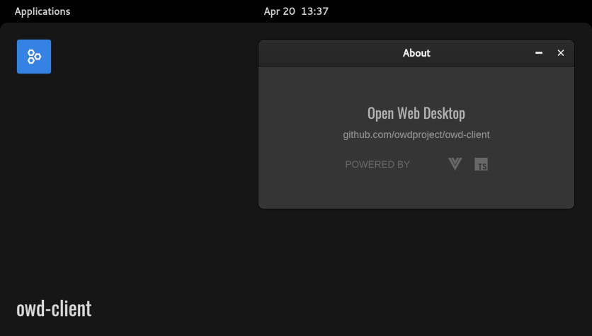

<p align="center">
  
</p>

# About App

> About app for your Open Web Desktop client

## Overview

The OWD About App is a simple application for Open Web Desktop that displays some basic info.

## Quick Installation

1.  Navigate to your OWD client folder in your terminal:
    ```bash
    cd owd-client
    ```
2.  Install the module using npm or yarn:
    ```bash
    npm install https://github.com/owdproject/app-about.git
    ```
3.  Register the application in your OWD configuration file (`owd.config.ts`):
    ```typescript
    // owd.config.ts
    import AppAbout from 'owd-app-about/owd.config'
    
    export const owdConfig = {
        theme: ['github:owdproject/theme-win95', { install: true }],
    
        loader: async () => {
            await defineDesktopApp(AppAbout)
        }
    }
    ```

## Compatibility

This application is compatible with Open Web Desktop client version `3.0.0-alpha.0`.

## License

This project is released under the [MIT License](LICENSE).